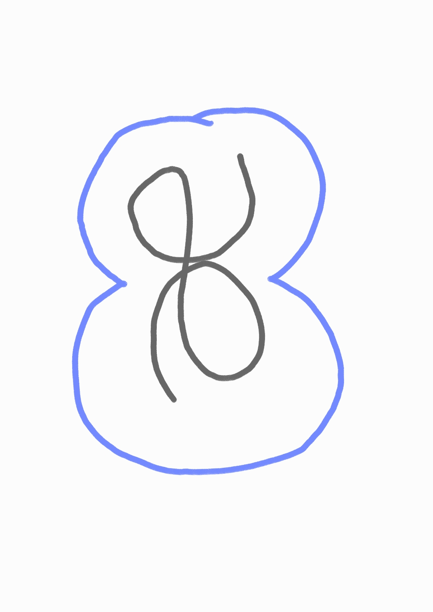

<p align="center">
  
</p>

<h1 align="center">AethelHook</h1>
<p align="center"><b>AI agent permission gateway — approve or deny every AI tool call from your phone.</b></p>

---

## What it is

When an AI coding agent — **Claude Code**, **Codex**, or **Antigravity** — wants to run a
shell command, write a file, or do anything else on your PC, AethelHook routes that
request to your Android phone first. You get a notification, tap Allow or Deny, and the
agent proceeds or stops. In real time, from anywhere your phone has a connection.

AI coding agents are powerful but dangerous by default — they can execute arbitrary
shell commands, overwrite or delete files, and install packages. Most IDEs show a quick
"Allow / Deny" popup on the same screen you're already working in, which is easy to
click through on autopilot. AethelHook forces that decision onto a second device, so
approving something dangerous takes a deliberate action, not a reflex.

It also lets you send prompts *to* your PC from your phone — kick off a headless
Claude Code or Codex run in a known project directory and get the result pushed back,
without touching the keyboard.

## Features

- **Multi-IDE**: Claude Code, Codex, and Antigravity, each via their own native hook
  mechanism, all routed through the same gateway.
- **Real-time approval** over a TLS + certificate-pinned WebSocket (LAN or Tailscale) —
  no cloud relay, no third-party push service in the loop.
- **Five decision options**: allow once, always allow (this project), always allow
  (global), deny, deny with a reason (fed back to the agent as an instruction).
  "Always allow" matches the *exact* command, not just its first word, so approving
  `git status` once doesn't silently approve every future command that happens to
  start with `git`.
- **Plan review** — Claude Code's `ExitPlanMode` ("Accept this plan?") is routed to
  the phone too, with the full plan text and an option to keep planning with feedback.
- **Clarifying questions** — `AskUserQuestion` is answered from the phone instead of
  an in-IDE dialog, including multi-select and free-text "Other" answers.
- **Session Access** — send a prompt from your phone to run headlessly (`claude -p` /
  `codex exec`) in a known project directory on your PC; each project keeps its own
  resumable conversation, per agent.
- **Secure device pairing** — a QR code (scanned from a loopback-only page on the PC)
  hands a phone a real, per-device token; no token is ever broadcast over the network.
- **Approval history**, a phone-managed always-allow list, dark/light mode.

## Architecture

| Component | What it is |
|---|---|
| `AethelHook.API/` | .NET 9 ASP.NET Core service, runs as a Windows Service under LocalSystem. Two listeners: port `5264` (HTTPS, phone-facing — LAN/Tailscale/WAN) and a loopback-only port `5266` (plain HTTP, used only by local hook scripts, the Tray app, and the pairing page). |
| `AethelHook.Tray/` | WPF tray app — the interactive-user-facing UI for status, gateway toggle, and device pairing (the API service itself can't touch the desktop; see "Windows Session 0" below). |
| `app/` | Android Kotlin/Jetpack Compose app — Dashboard, Session, History, and Settings tabs. |
| Hooks | PowerShell scripts per IDE (`.claude/hooks/`, `.codex/hooks/`, `.gemini/hooks/`) that intercept tool calls and route them to the API. |

```
Agent wants to run a tool
  │
  ▼
PreToolUse hook fires (on_approval_request.ps1)
  │  reads the tool call from stdin, checks the phone-managed allow-list
  │
  ▼
POST /hook/event → the API (loopback-only port 5266)
  │
  ▼
Pushed to the phone over a pinned WSS connection
  │
  ▼
Phone shows a full-screen notification: Allow once / Always allow / Deny / Deny with reason
  │
  ▼
Decision sent back over the same WebSocket
  │
  ▼
Hook receives it: exit 0 (allow) or exit 2 + a reason (block)
```

### Windows Session 0

The API runs as a Windows Service under `LocalSystem`, which Windows isolates from the
interactive desktop (Session 0) — it cannot see or focus windows, inject input, or do
anything that needs a real desktop session. Anything that does (pairing, status,
manual gateway toggling) goes through the Tray app instead, which runs as the logged-in
user.

## Security model

- Every paired device gets its own token (`devices.json`); tokens and PSKs are compared
  with constant-time comparison.
- The phone-facing port is HTTPS with a self-signed certificate; the phone pins the
  exact SHA-256 fingerprint it received via the QR code (not a certificate authority) —
  fails closed if no fingerprint is stored rather than trusting anything by default.
  The certificate's own password is randomized per install, not hardcoded.
- Sensitive files under `C:\ProgramData\AethelHook\` (device tokens, the TLS private
  key, session state) are hardened to Administrators + SYSTEM only, not left readable
  to every local Windows account.
- The Android app stores its token and pinned fingerprint in an encrypted
  (Keystore-backed) preferences file, excluded from Android backup/device-transfer.
- No CORS on the API, no third-party push/relay service in the loop, no telemetry.

See [SECURITY.md](SECURITY.md) to report a vulnerability.

## Installation

There isn't a polished download page yet. For now, build from source:

**PC:**
```powershell
git clone https://github.com/aethelst8/aethelhook.git
cd aethelhook
dotnet publish AethelHook.API\AethelHook.API.csproj -c Release -r win-x64 --self-contained true -o dist\publish
dotnet publish AethelHook.Tray\AethelHook.Tray.csproj -c Release -r win-x64 --self-contained true -o dist\publish-tray
& "$env:LOCALAPPDATA\Programs\Inno Setup 6\ISCC.exe" AethelHook.iss
```
This produces `AethelHook-Setup.exe` — run it (elevated) to install the service, the
hooks, and the Tray app.

> **Note:** the installer isn't code-signed yet — the usual free routes for open source
> projects (SignPath, OSSign) require release history this project doesn't have yet,
> and Microsoft Trusted Signing currently only accepts individual developers in the
> US/Canada. So Windows SmartScreen will likely show "Windows protected your PC" the
> first time you run it — click **More info → Run anyway**. Same applies to installing
> the APK — Android will warn about installing from an unknown source; that's expected
> for a sideloaded app not yet on the Play Store.

**Phone:**
```bash
export JAVA_HOME="/c/Program Files/Android/Android Studio/jbr"
./gradlew.bat assembleRelease
adb install app/build/outputs/apk/release/app-release.apk
```
Open the app, then on the PC open `http://localhost:5266/pair` and scan the QR code
shown there.

## Development

```powershell
# API — compiles only, does NOT touch a live installed service
cd AethelHook.API && dotnet build

# Redeploy the live dev service + Tray app (elevated PowerShell)
.\install.ps1

# Android
export JAVA_HOME="/c/Program Files/Android/Android Studio/jbr"
./gradlew.bat assembleDebug
adb install -r app/build/outputs/apk/debug/app-debug.apk
```

See [CLAUDE.md](CLAUDE.md) for the full technical reference — architecture details,
hook wiring per IDE, and a running list of non-obvious gotchas hit while building this.

## Contributing

See [CONTRIBUTING.md](CONTRIBUTING.md).

## License

[MIT](LICENSE)
